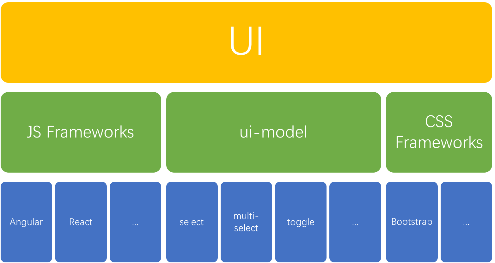

# ui-model

## What is ui-model？

ui-model is first and foremost a concept of attempting to abstract logic from ui controls and business requirements. The project *ui-model* is a set of the streamlined UI logic for frontend developers. No matter what framework you use, and regardless of their appearance, the logic behind many interactive UI controls can be abstracted to a few, we call them **ui-model**.

Let's elaborate the above statement with an example. What do the following controls have in common?

You guessed right, their logic are exactly the same i.e. ***n* choose *1***.

Maybe it is obviously to you, but let's explore further. Are there other interactive controls that share the same *n* choose *1* logic? Please try to make a list in your mind, you may be surprised how common they are.

The list below is by no means exhaustive: 

1. **Tabset** - only one tab can be activated at a time

1. **Menu** - only one menu item can be highlighted or selected at a time

1. **Accordion** - only one item can be expanded at a time. 

1. **Button Group** - only one button can be selected at a time

1. **Pagination** - only one page can be activated at a time

1. A **tree** or a **grid** that only allow one item to be expanded at a time

1. A **table** that can only be sorted by one column at a time. 

Behind all of the above simple or intricate controls, is the simplest ***n* choose *1*** logic, which can be implemented in about 10 lines of code. This is the power of high-level abstraction. 

You have seen some controls with *n* choose *1* logic now, but can you list some UI controls with ***n* choose *k*** or ***toggle***?

**ui-model** is an attempt to abstract the interactive logic from all ui controls. It does not limit to ui controls, 

## the conceptual model of ui-model

In the above conceptual model, ui-model is parallel to JavaScript frameworks and CSS frameworks. These three components are independent from each other. We can freely mix and match them. JavaScript framework is responsible for synchronizing model and view. CSS frameworks are responsible for presentation. ui-model is focused on interactive logic. 

We will also provide some binding libraries to reduce adaption complexity for popular frameworks, such as *ui-model-angular* for Angular and *ui-model-react* for React. We welcome the community distribute their own binding libraries.

## Why are traditional component libraries difficult to reuse?  

If you use a third party component library, you probably have experienced some of the common drawbacks. 

Firstly, most component libraries are tightly coupled with a frontend framework. A component library for Angular is obviously not usable with React, and vice versa. Some libraries are also tightly coupled with a CSS framework, which is probably alright if the binding CSS framework is well designed, for example Bootstrap, because it is highly customizable. If the CSS framework is not well designed, then you may have to modify its source code, which will disrupt the original distribution which is never a good thing.

Secondly, component libraries' configuration can be complex. Some large libraries require dedicated learning just to get started, and if switching libraries, what you learned for the old library would be wasted. It is true that these libraries are designed to solve complex problems, however what lies beneath these complex problems are a few common and simple interactive logic, as mentioned above, may controls are based on abstracted ***n* choose *1***. There is a better way to handle these complex problems.

Finally, it can be difficult to balance between complexity and customization. Customizable libraries is not only difficult to develop, but also harder to use. Traditional component library normally achieve customization through configuration, mostly via callback functions. However this approach will inevitably lead to complex documentation and heavy memory burden.    

So, what are the root cause that make component libraries difficult to reuse? The answer is: They violated the SoC (Separate of Concerns) design principle. Traditional component has three concerns: view (HTML), model/logic (JavaScript) and styling (CSS). When these three concerns are tightly coupled together, complicity is inevitable.  

Many CSS frameworks have been independent for a long time. For example, Bootstrap's CSS part only implements styling and is completely independent from HTML and JavaScript. It is because of its well designed architecture, it quickly became popular. 

ui-model is the Bootstrap in JavaScript world. 

In summary, view (HTML) depends on business requirement and it is best to leave it to Apps to implement. Frontend frameworks are responsible for bridging interactive logic and view. ui-model assumes that frontend frameworks can synchronize model and view, however it does not care about their implementation details, it can be via data binding or utilizing virtual dom. 

## Future of ui-model

ui-model is simple, but it has a bright future. Apart from select, multi-select and toggle, it also has complex interactive logic such as slice and map, it can also handle more complex logic like calendar.

On top of these common interactive logic, it can also implement logic that are specific to business requirements. For example, for a shopping cart, we can abstract the business logic to a ui-model, all the view has to do is binding this ui-model. This shopping cart specific ui-model would be independent from view and css. 

## History and presence

The ideologic of ui-model came from my research on internal reusability within enterprises in the last two years. I found that the fundamental barrier against reusability is violation to SoC design principle and thus to OCP design principle.

Through applying the ui-model ideas in real world projects, I was able to simplify many problems and experience their benefits and advantages.

To formally present to the community, we created a github organisation named *ui-model* and we welcome the community to contribute with gratitude. 

## What's next

We will share the already implemented ui-models with the community. We hope they can serve as the seed ui-models to inspire the community to join us and develop more re-usable ui-models. 

Please note, ui-model is first and foremost an idea or a theory, it does not limit to any library. We hope that we could see more library implementing the same idea. We would love to see health and positive competitions, it is the the very definition of a booming community. 

We hope that when you implement the idea/theory, you do not limit to interactive logic, but extend to business logic. We hope that the ui-model idea/theory could help you to develop your apps that are more inline with SoC design principle and thus highly reusable. 

## Contribution

Our base is <https://github.com/ui-model>. We welcome you to star & fork it.

Our development plan is to firstly implement a TypeScript version. Because TypeScript's strong support for typing, it is helpful to API design process. 

We will use RxJS to expose event interfaces, but we will limit ourselves from advanced the features.

We will implement a binding library for Angular 2 with demo usage samples. We welcome ReactJS and other framework developers to join us and implement binding libraries specific to individual frameworks. We also reserved a repository for JQuery developers considering the large amount of legacy applications online.

We welcome you raise issues to let us know your requirement and use cases and also report bugs. No matter we are able to accept or not, we greatly appreciate your PR. 

We encourage the community to develop competitive libraries based on the same ui-model theory. We would love to link quality libraries here. May we suggest that you use ui-model tag or prefix your library name with `ui-model-...` to increase visibility to potential users. 
